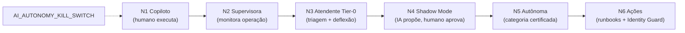

# Roadmap V10 — IntegraGLPI: do Copiloto à IA Autônoma Atendendo

PHASE: `integaglpi_v10_roadmap_001` — Versão FINAL: 2026-06-12 (rev. 4)
Status: **M0 DOCUMENTAL FECHADO COMO `DONE_COM_RESSALVAS` — V10-1 depende de GO manual explícito do operador**
Antecessor: Roadmap V9 (`CODE_CLOSE_COM_RESSALVAS`)
Insumos: auditoria multi-perspectiva verificada em código (36 claims, 2026-06-12) +
arbitragem de 4 propostas externas de roadmap (seção 8).

---

## 0. Objetivo final declarado e invariantes permanentes

> **O objetivo final do sistema é ter uma IA autônoma atendendo e resolvendo
> chamados.** (Declaração do operador, 2026-06-12. SLA, CSAT, FCR e produtividade
> são indicadores de sucesso; a meta principal é a IA no atendimento.)

O V10 chega lá por **escalada controlada de confiança**, nunca por chave ligada:
`Fundação → Copiloto pleno → Shadow Mode → Autonomia restrita por categoria →
Autonomia plena por classe de serviço`. Os invioláveis do V9
(`no_auto_whatsapp_send`, `no_ticket_auto_mutation`, `no_kb_auto_publish`)
passam de absolutos a **default relaxável por categoria certificada**, somente
dentro das fases M4–M7, cada relaxamento com gate humano, métrica e reversão.

### Invariantes que NUNCA mudam, nem no nível máximo de autonomia

| # | Invariante | Detalhe |
| --- | --- | --- |
| I1 | **Sem LLM em conversa livre com o cliente** | Política Meta WhatsApp Business 2026 (proibição de chatbot de propósito geral) + anti-alucinação. Toda resposta autônoma é ancorada em KB `approved` ou fluxo estruturado/template. |
| I2 | **Handoff humano universal** | "Falar com um humano" disponível em 100% das interações autônomas; claim humano sobrepõe a IA instantaneamente; conversa ejetada chega à fila com prefixo `[IA]` + resumo estruturado + o que já foi tentado. |
| I3 | **Kill switch global** | `AI_AUTONOMY_KILL_SWITCH` retorna todo o sistema ao modo copiloto (N1) em um toggle, sem deploy. |
| I4 | **Fail-safe determinístico** | Ollama/LLM indisponível ou timeout → mensagem estática de contingência + transferência à fila humana. A IA cair NUNCA derruba o atendimento. |
| I5 | **Confiança abaixo do limiar = humano** | `KB_INSUFFICIENT` ou confidence score < limiar da categoria → handoff, nunca chute. |
| I6 | **Identidade transparente** | A IA sempre se identifica como assistente virtual; jamais simula ser humana. |
| I7 | **Identity-First Guard** | Nenhum fluxo de segurança (reset, liberação de acesso) sem validação de identidade reforçada (fator adicional fora do WhatsApp). **Credencial/senha NUNCA trafega por WhatsApp.** |
| I8 | **Blast radius limitado** | Mutação autônoma de ticket restrita a: criar, followup, solução, `solved` após confirmação do usuário. **Proibido mesmo em N5/N6:** `closed` direto, exclusão, mudança de entidade/prioridade/ativo/grupo, reatribuição de técnico, merge de tickets, publicação de KB nativa, reset/liberação sem Identity-First Guard (I7) + canal seguro de entrega. |
| I9 | **Auditoria imutável** | Toda decisão da IA registrada: entrada, KB usada, confiança, resposta, resultado, intervenções. |
| I10 | **Aprendizado curado** | A IA melhora via curadoria humana de KB, anchors, prompts e feedback agregado. **Sem retraining autônomo de modelo**; sem deriva não supervisionada. |
| I11 | **PII Guard sempre** | Mascaramento antes de qualquer contexto chegar ao LLM, em todos os níveis. |
| I12 | **Fronteiras de arquitetura** | Node nunca acessa MariaDB GLPI; cloud só com consentimento + cadeia AI_PILOT_*; produção só com gate humano; HML-first; flags novas nascem `false`. |

---

## 1. Herança do V9 (base comprovada em código)

Verificado por auditoria em 2026-06-12 (36 claims contra o repositório):

| Capacidade | Evidência |
| --- | --- |
| Central de Atendimento (claim atômico, reply, transfer) | `AttendanceCenterService` (3.451 linhas) + lock transacional |
| Cockpit agregador do supervisor | `SupervisorCommandCenterService` (backoffice + quality + monitor online + alertas IA) |
| Monitor online tempo real (polling 15s) | `OnlineMonitorService` + `central.php` |
| SLA operacional (deadlines, status, % consumido, breach) | `OperationalSlaService` + `sla_context` no payload da Central |
| CSAT pós-atendimento com botões + reabertura medida | `sendConfiguredCsatPrompt` + `solution_actions` |
| Solução com botões Aprovar/Reabrir no WhatsApp | `sendSolutionApprovalRequest` |
| Memória de contato (não repete perguntas) | `ContactProfileService` com confirmação de perfil |
| Inatividade: 3 lembretes + autoclose com aviso prévio | `InactivityAutomationService` |
| Risco/sentimento em tempo real (score 0–100) | risk engine + `AiOnlineSupervisorAlertService` |
| Copiloto de rascunho (IA local, humano envia) | `CopilotDraftService` + `copilot.draft.php` |
| Classificador de categoria IA (flag) + triagem nativa GLPI (flag) | `GlpiCategoryClassifierService`, `NATIVE_GLPI_TRIAGE_*` |
| Smart Help V9 (resumo multi-problema, busca por problema, resposta customizada flag-gated) | fases `integaglpi_v9_kb_*` |
| Busca KB operacional **10/10 no smoke real HML** | planner + ranking (grupos de ecossistema) + gate `needs_review` HML-only |
| Feedback bias + reranker (flag-gated, bulk, observável) | `FEEDBACK_RANKING_ENABLED` / `RERANKER_ENABLED` |
| Mineração histórica de chamados + gap analysis de KB | `AiOperationsService` (preview/execute) + F6 `detectRecurringGaps` |
| RBAC 54 direitos + Central de Segurança + PII duplo + CSRF/bearer | `SecurityPermissionService` |
| Entidades, contratos e banco de horas | `entity_contracts`, `hour_adjustments`, `ContractHoursRepository` |
| Idempotência webhook, correlation_id ponta a ponta, dead letter (tabela+monitor) | migrations + `correlationId.ts` |
| LogMeIn read-only: alarmes, correlação F4, advisory F5 (action matrix), conciliação F6 | fases `integaglpi_v9_*` |
| Gate vetorial: KEEP_CURRENT_SEARCH | ADR-004 (critérios objetivos de reavaliação) |

**Lição da auditoria que governa o V10:** muito do que análises externas mandam
"criar" já existe — a regra é **LIGAR → EXPOR → INTEGRAR antes de construir**.

---

## 2. Escada de maturidade da IA (régua única do V10)

| Nível | Nome | O que a IA faz | Macro |
| --- | --- | --- | --- |
| N1 | Copiloto assistivo | Resume, sugere KB, rascunha; humano executa tudo | **ENTREGUE (V9)** → pleno em M1 |
| N2 | Supervisora operacional | Fiscaliza: SLA em risco, parados, risco de cliente, KB gap, incidente maior | parcial (V9) → completa em M2 |
| N3 | Atendente de triagem + tier-0 | Recebe o usuário, entende, coleta dados, monta o chamado; resolve FAQ com KB aprovada mediante confirmação do usuário | M4 |
| N4 | Resolutiva supervisionada (**Shadow Mode**) | IA monta a resposta final com confidence score; técnico aprova em 1 clique; acurácia medida por categoria | M5 |
| N5 | **Autônoma controlada** | IA atende e resolve end-to-end em categorias certificadas, sem aprovação prévia | M6 — **o objetivo declarado** |
| N6 | Autônoma com ações | Executa ações de baixo risco pré-aprovadas (reset, liberação) com Identity Guard e rollback | M7 (horizonte) |

### Gates de promoção (por dados, nunca por calendário)

```yaml
GATES_DE_PROMOCAO:
  N1_pleno (saida M1):
    - adocao_copilot_inline: ">= 60% dos tecnicos ativos usam o rascunho"
    - notificacao_assumido_ativa: true
  N2 (saida M2):
    - cockpit_unico_em_uso_diario: true
    - taxa_sugestao_ia_aceita_vs_apagada: "medida e publicada no painel"
  N2_para_N3 (entrada M4):
    - v9_closure_done: true            # M0 completo
    - m3_observabilidade_concluida: true
    - kbs_approved_tier0: ">= 10 categorias com KB aprovada"
    - busca_top1_smoke_real_pos_deploy: ">= 9/10"
  N3_para_N4 (entrada M5):
    - deflexao_tier0_30d: ">= 20% das interacoes elegiveis"
    - falso_resolvido_tier0: "< 5% (reaberto <= 72h apos 'Resolveu')"
    - csat_tier0: ">= 4.0/5"
    - zero_incidentes_pii_ou_alucinacao: true
  N4_para_N5 (entrada M6, POR CATEGORIA):
    - aprovacao_sem_edicao_30d: ">= 90%"
    - acerto_confirmado: ">= 85% (aprovadas sem reabertura em 72h)"
    - tempo_medio_aprovacao: "< 5 min (revisao virou carimbo estatistico)"
    - reabertura_pos_ia: "< 10%"
    - csat_historico_categoria: ">= 4.5"
  N5_estavel (saida M6, por categoria):
    - piloto_hml_30_45d_zero_incidente_alto: true
    - producao_assistida_com_amostragem: "100% -> 25% -> 5%"
    - resolucao_autonoma_na_categoria: ">= 60% com falso_resolvido < 5%"
  N5_para_N6 (entrada M7, POR ACAO):
    - n5_estavel_90d_producao: true
    - runbook_certificado + rollback_testado + rbac_dedicado: true
    - identity_first_guard_implementado: true
    - aprovacao_direcao_e_dpo_por_tipo_de_acao: true
  REBAIXAMENTO:
    - incidente_severidade_alta: "categoria volta automaticamente ao nivel anterior e exige recertificacao"
```

### Diagrama — escada N1→N6



---

## 3. M0 / P0 — Fechamento total do V9 (pré-requisito absoluto)

`integaglpi_v10_m0_v9_closure_001` · **Nenhuma fase do V10 inicia antes do M0 = DONE.**

**Fechamento documental M0 — 2026-06-12**

| Item | Resultado |
| --- | --- |
| Deploy formal HML Git-backed | PASS — HML em `18e16f2`; `3c099a8` ancestral confirmado; build Docker formal do `integration-service` |
| Hot-patch | Eliminado como estado final; restart preserva `kbSearchStatusPolicy` e `ISOLATED_PRODUCT_GROUPS` no `dist` |
| Smoke RAG real | PASS — `postgres_hml_real`, 10/10 queries, 10/10 top-1, 0 falhas |
| Flag `KB_SEARCH_INCLUDE_NEEDS_REVIEW_HML_ONLY` | OFF em repouso; usada somente na linha do comando do smoke |
| Disco HML | 95% -> 71% via `docker image prune -f`; volumes/backups preservados |
| Produção | Intocada |
| Ressalvas aceitas | S1-S6 não reexecutados nesta fase documental; stashes antigos apenas classificados; relatório de smoke arquivado |

Inventário exaustivo das pendências do V9 (estado em 2026-06-12):

### P0-A · Código e versionamento

| ID | Pendência | Critério de conclusão |
| --- | --- | --- |
| A1 | **Commit do pacote fix_002** (busca operacional): flag `KB_SEARCH_INCLUDE_NEEDS_REVIEW_HML_ONLY` + `kbSearchStatusPolicy.ts` + statuses dinâmicos no repositório + smoke real/simulação + testes + fixtures + docs | Cursor review CLOSE → commit manual (1 fase = 1 commit) |
| A2 | **Commit do fix de ranking** (grupos de ecossistema `ISOLATED_PRODUCT_GROUPS` que levou o smoke de 8/10 a 10/10): `KbRankingService.ts` + 3 testes de regressão + `phpSmartHelpStatic` atualizado | Idem — pode compor o mesmo changeset do A1 se o Cursor aceitar como fase única de busca operacional |
| A3 | **Commit deste roadmap** (`docs/roadmap_v10.md`) após aprovação do operador | FECHADO no M0 documental: roadmap atualizado para `DONE_COM_RESSALVAS`; V10-1 ainda exige GO manual |
| A4 | **Stash `kb-enrichment-ollama-tuning`** (`stash@{0}`: OllamaClient options + KbEnrichmentService + teste) | CLASSIFICADO SOMENTE — não aplicado e não apagado; decisão binária fica para contrato próprio pós-M0 |
| A5 | **Stash `pre-v9-hml-close`** (`stash@{1}`) e stashes antigos | CLASSIFICADO SOMENTE — nenhum stash aplicado/apagado no M0 documental |
| A6 | **Artefatos `tmp/` untracked** (kb_*.sql/md já aplicados, tarballs de deploy, relatórios) | FECHADO para smoke RAG: relatório canônico arquivado em `docs/eval_reports/kb_operational_search_smoke_real_2026-06-12.yaml`; tarballs continuam fora do commit |
| A7 | `docs/eval_reports/ragas_*.json` e `reranker_benchmark_*.json` untracked "por decisão" | Decisão final registrada (commitar como evidência ou manter untracked documentado) |

### P0-B · Deploy e ambiente HML

| ID | Pendência | Critério de conclusão |
| --- | --- | --- |
| B1 | **Deploy formal do integration-service em HML** | PASS — fonte Git restaurada por bundle; HML `HEAD=18e16f2`; imagem Docker rebuildada sem `docker cp` como deploy final |
| B2 | **Re-execução do smoke real 10/10 PÓS-deploy formal** | PASS — `docs/eval_reports/kb_operational_search_smoke_real_2026-06-12.yaml`, `source=postgres_hml_real`, 10/10 top-1 |
| B3 | **Boot limpo** | PASS — restart sem crash loop; `/health` ok; fix presente no `dist` após restart |
| B4 | **Flags restauradas** | PASS — `KB_SEARCH_INCLUDE_NEEDS_REVIEW_HML_ONLY` não permanece true em `.env`, compose ou env do container |
| B5 | **Disco HML ~87%** | PASS — 95% -> 71% com `docker image prune -f`; sem `docker system prune -a`, sem volumes/backups |

### P0-C · Smoke HML final (checklist S1–S7)

| ID | Pendência | Critério de conclusão |
| --- | --- | --- |
| C1 | **S1** — Saúde Técnica com perfil autorizado e sem direito (D08) | RESSALVA ACEITA — não reexecutado nesta fase documental |
| C2 | **S2** — Smart Help com flags off (legado byte-idêntico) | RESSALVA ACEITA — não reexecutado nesta fase documental |
| C3 | **S3** — `CUSTOM_RESPONSE_ENABLED=true` | RESSALVA ACEITA — não reexecutado nesta fase documental |
| C4 | **S4** — `FEEDBACK_RANKING_ENABLED=true` | RESSALVA ACEITA — não reexecutado nesta fase documental |
| C5 | **S5** — `RERANKER_ENABLED=true` | RESSALVA ACEITA — não reexecutado nesta fase documental |
| C6 | **S6** — Encerramento | PASS parcial no escopo M0 — flags/rest/health/boot validados; demais itens mantidos como ressalva operacional |
| C7 | **S7** — KB operational search | PASS — smoke real HML pós-deploy formal 10/10 top-1; flag restaurada |

### P0-D · Base de conhecimento

| ID | Pendência | Critério de conclusão |
| --- | --- | --- |
| D1 | **Revisão humana dos 33 KBs `needs_review`** | Lista priorizada; cada KB: promover a `candidate`/`approved`, devolver para ajuste, ou arquivar |
| D2 | **Promoção dos KBs 307–315** (metadados estruturados completos, validados pelo smoke 10/10) | Mínimo: as 10 categorias do smoke com KB `approved` — pré-requisito do gate N2→N3 |
| D3 | **Caminho permanente sem flag** | Com D1/D2 feitos, busca operacional funciona com `approved`+`candidate` puro; flag HML-only volta a ser só ferramenta de preview |
| D4 | Relatório KB_FOUND vs KB_INSUFFICIENT inicial (baseline de cobertura) | Snapshot registrado a partir do `rag_audit` |

### P0-E · Fechamento documental e baseline

| ID | Pendência | Critério de conclusão |
| --- | --- | --- |
| E1 | Atualizar documentação M0 com o resultado do smoke S1–S7 e decisões A4–A7 | FECHADO neste roadmap/checklist; `roadmap_v9_closure_ressalvas.md` permanece fora da allowlist desta fase |
| E2 | **Declarar V9 = `DONE_COM_RESSALVAS`** | FECHADO — registro formal com data e evidência RAG HML 10/10 |
| E3 | **Congelar baseline V10** dos KPIs da seção 6 | FECHADO — `docs/baseline_v10_kpis.json` criado com métricas conhecidas e nulos auditáveis para KPIs ainda sem medição M0 |
| E4 | Aprovação formal deste roadmap pelo operador | PENDENTE — V10-1 depende de GO manual explícito |

**Gate de saída do M0 documental:** `DONE_COM_RESSALVAS` · produção intocada ·
nenhuma flag ligada em repouso · smoke 10/10 a partir de deploy formal ·
V10-1 bloqueado até GO manual explícito do operador.

---

## 4. Macros M1–M7

### M1 — Quick Wins de ativação (N1 pleno: ligar o que está pronto)

`integaglpi_v10_m1_quick_wins_001`

| Entrega | Base existente | Tipo |
| --- | --- | --- |
| Notificação "seu chamado foi assumido por {técnico}" no claim | Config `technician_assumed_message` existe; falta conectar o envio ao evento | LIGAR |
| Countdown SLA visual na Central (verde/amarelo/vermelho + ordenação por urgência) | `sla_context` já chega no payload | EXPOR |
| Top-3 KBs sugeridas ao abrir conversa na Central (com motivo e fonte) | Planner + ranking prontos | EXPOR |
| Botão "Inserir rascunho do Copiloto" inline na caixa de resposta | `copilot.draft.php` + endpoint Node prontos | INTEGRAR |
| Templates de resposta rápida humanizados por categoria | `MessageConfigurationService` | ESTENDER |
| Feedback útil/não útil visível e medido (kb_candidate_id) | Já implementado — garantir exposição na Central | EXPOR |

Invariantes: nenhuma mensagem sai sem clique humano. Gate de saída: adoção do
copiloto inline ≥ 60% dos técnicos ativos; notificação de claim ativa e medida.

### M2 — Cockpit do gestor + IA supervisora completa (N2)

`integaglpi_v10_m2_cockpit_001`

- **Tela única "Operação ao Vivo"** elevando `SupervisorCommandCenterService`:
  abertos agora, sem técnico, parados > X min, SLA em risco 30 min, fila por
  técnico/entidade, TPR/TMR, CSAT do dia, reaberturas, KB_FOUND vs
  KB_INSUFFICIENT, **uso da IA (sugestões aceitas vs apagadas, por técnico/chamado)**,
  top assuntos recorrentes, dead letter, alarmes LogMeIn correlacionados.
- **Alertas proativos internos** (e-mail/notificação GLPI — nunca WhatsApp ao
  cliente): SLA amarelo, chamado parado, deterioração de cliente, fila acima da
  capacidade. **Risk engine exposto:** cards no cockpit agregando
  `AiOnlineSupervisorAlertService` + `risk_scores` (score 0–100, tendência,
  conversas/tickets em alerta) com drilldown para Monitor Online — reutilizar
  worker e repositório existentes, sem novo motor.
- **Relatório periódico automático** (export CSV/PDF agendado) — gap real confirmado.
- **Sugestão de incidente maior**: agrupamento de chamados/conversas similares
  (estende o padrão da correlação F4 para tickets; read-only, humano decide).
- **Mineração histórica 24 meses → KB gap**: operacionalizar `AiOperationsService`
  (preview/execute já existem) + F6 `detectRecurringGaps` ligados ao painel —
  clusters recorrentes viram candidatos revisáveis (`human_review_required=true`,
  `auto_publish=false`, sem duplicar KB existente, sem PII).

Regra técnica: dashboard consome agregações/snapshots (M3) e cache Redis TTL
curto; nunca query pesada no PHP.

### M3 — Robustez de dados e observabilidade (fundação da autonomia)

`integaglpi_v10_m3_data_hardening_001`

- Views materializadas/snapshots para Quality Dashboard e cockpit (hoje: JOIN +
  LATERAL em tabela crua) + índices validados por EXPLAIN. **Alvo: painel < 2s.**
- Política de retenção 90d para `audit_events`/`messages` formalizada como job
  gateado (hoje é comentário no SQL).
- Reprocessamento controlado da dead letter (retry com backoff + UI de fila).
  **Alvo: zero mensagem morta sem tratamento.**
- Healthcheck consolidado incluindo **Ollama**; latência p95 por endpoint;
  endpoint de métricas read-only (formato Prometheus-compatível).
- Pipeline de deploy único build→test→imagem→HML→prod manual (consolida B1 do M0).

**Racional:** IA autônoma sem observabilidade é cega; M3 torna M4–M6 auditáveis
e é gate de entrada do N3.

### M4 — IA Atendente: triagem inteligente + deflexão tier-0 (N3 — primeira autonomia real)

`integaglpi_v10_m4_ai_attendant_001` · Flags: `AI_TRIAGE_ATTENDANT_ENABLED=false`,
`TIER0_DEFLECTION_ENABLED=false`

**Workstream 4A — Atendente de triagem** (risco baixo: a IA conversa para
ENTENDER, não para resolver):

- Classificação de intenção (incidente / requisição / dúvida / retorno /
  reabertura) e detecção de urgência/impacto — base: `GlpiCategoryClassifierService`
  + risk engine, sempre determinístico-primeiro com LLM local como refino.
- Coleta guiada de dados mínimos por categoria (FSM existente + perguntas
  adaptativas estruturadas; aproveita memória de contato para não repetir).
- Resumo técnico sem PII + sugestão de categoria/fila/entidade/equipamento →
  **chamado nasce completo e bem roteado**.
- Permitido: perguntar, preencher resumo, sugerir categoria/fila. Bloqueado:
  resolver, fechar, executar ação, enviar solução final.

**Workstream 4B — Deflexão tier-0** (antes da abertura do ticket):

**Allowlist tier-0 inicial (contrato de fase M4 — base smoke 10/10 HML):**

| query_id | KB alvo | Categoria operacional | Justificativa |
| --- | --- | --- | --- |
| `teams_login` | 307 | Microsoft Teams — login/cache | Smoke top1; KB operacional v2 |
| `antivirus_fp` | 310 | Antivírus — falso positivo | Smoke top1 |
| `ntfs_share` | 308 | Permissão NTFS / pasta compartilhada | Smoke top1 |
| `onedrive_sync` | 314 | OneDrive / SharePoint sync | Smoke top1; ranking M365 corrigido |
| `scanner_twain` | 312 | Scanner / TWAIN | Smoke top1 |
| `erp_odbc` | 313 | ERP / ODBC / DSN | Smoke top1; ranking ERP/ODBC corrigido |
| `wifi_desktop` | 315 | Wi-Fi / adaptador wireless | Smoke top1 |
| `backup_synology` | 223 | Backup Synology / restauração | Smoke top1 |
| `office_m365` | 215 | Office M365 / licenciamento | Smoke top1 (216 alternativa top1) |
| `micromed_app` | 306 | Micromed — aplicativo | Smoke top1; isolamento cross-grupo validado |

Pré-requisito gate N2→N3: KBs acima com status **`approved`** (D2). Confiança mínima
por categoria definida no contrato `integaglpi_v10_m4_ai_attendant_001` (default sugerido:
ranking top1 + score ≥ limiar configurável, nunca abaixo do gate Smart Help).

1. Problema classificado em categoria da **allowlist tier-0** acima E confiança ≥ limiar.
2. IA envia a orientação da KB (texto ancorado, sem geração livre) + botões
   `[Resolveu ✅] [Quero um técnico 👤]`.
3. `Resolveu` → deflexão registrada (sem ticket) + CSAT. `Quero um técnico` ou
   silêncio → fluxo humano com chamado **já enriquecido** ("KB tentada: X").
4. `KB_INSUFFICIENT`/baixa confiança → nem oferece; direto ao humano.
5. Máx. 1 tentativa de deflexão por conversa; nunca em fila VIP/contrato crítico.
6. **Estimativa de fila para o usuário** ("você é o 3º; previsão ~N min") — exposta
   no fluxo WhatsApp quando tier-0 não resolve e antes do handoff humano (contagem
   read-only da fila PostgreSQL + TPR médio rolling).

Métricas novas: `% atendidos inicialmente pela IA`, `deflection_rate`,
`false_resolution_rate` (reaberto ≤ 72h pós "Resolveu").
Gates de saída: ver `N3_para_N4` na seção 2.

### M5 — IA Resolutiva supervisionada / Shadow Mode (N4)

`integaglpi_v10_m5_supervised_resolution_001` · Flag: `SUPERVISED_RESOLUTION_ENABLED=false`

- Para conversas/tickets das categorias graduadas no M4: a IA monta a **resposta
  final completa** (resposta customizada V9 + KB fonte) com **confidence score
  0–100 visível**, e a coloca numa **fila de aprovação** na Central.
- Técnico vê: resposta pronta + KB + score → `[Enviar] [Editar] [Descartar]`
  (1 clique). Score ≥ 0.90 ganha destaque visual de aprovação acelerada.
- **Toda edição registra o diff IA×humano** — é o dado que certifica categoria:
  aprovação sem edição ≥ 90% E acerto confirmado ≥ 85% (sem reabertura 72h).
- SLA de aprovação: sem ação em X min → alerta supervisor (nunca envia sozinho).
- Shadow Mode é o estado natural desta fase: a IA "trabalha" 100% dos casos
  elegíveis e sua acurácia é medida ANTES de qualquer envio sem aprovação.

### M6 — IA Autônoma controlada (N5 — **o objetivo declarado**)

`integaglpi_v10_m6_autonomous_attendance_001` · Flags:
`AUTONOMOUS_ATTENDANCE_ENABLED=false` (global) + `autonomous_categories`
(allowlist por categoria, vazia por default) + `AI_AUTONOMY_KILL_SWITCH`.

Para **categorias certificadas individualmente** (gate N4→N5):

- IA atende end-to-end: entende → responde com KB → acompanha → confirma
  resolução com o usuário → registra solução no ticket → dispara CSAT.
  **Sem aprovação prévia.** Blast radius do invariante I8.
- **Quarentena de intervenção (modo piloto) — mecanismo técnico:**
  - Estado Postgres `conversation_runtime.autonomy_hold_until` (timestamp) +
    `autonomy_review_sample_rate` (100/25/5) por categoria certificada.
  - Resposta autônoma gerada → gravada em `ai_autonomy_pending_outbound` (novo
    registro auditável) → **não** chama outbound imediato se `now < hold_until`.
  - Cockpit M2/M6: fila "Pendências IA" com polling 15s (mesmo padrão Monitor
    Online); botão supervisor `[Interceptar]` → claim humano + cancela pending.
  - Job `AutonomyHoldReleaseWorker`: quando `hold_until` expira sem interceptação,
    dispara outbound via `OutboundMessageService` (único caminho de envio).
  - Amostragem 100%→25%→5%: reduz `hold_until` duration e `review_sample_rate`
    por categoria após gates N5_estavel; kill switch I3 zera fila pending.
- Cockpit em tempo real: conversas autônomas ativas, taxa de sucesso,
  intervenções, score médio; **claim humano assume qualquer conversa na hora**.
- Fail-safe I4 ativo: LLM fora do ar → mensagem estática + fila humana.
- Piloto obrigatório 30–45 dias (HML → produção assistida). Incidente de
  severidade alta → categoria rebaixada automaticamente a N4 + recertificação.

### M7 — Ações autônomas de baixo risco (N6 — horizonte, fora do compromisso do V10)

`integaglpi_v10_m7_autonomous_actions_001`

- Evolui o action matrix do F5 (`ControlledAutomationService`): ações
  `advisory_only`/`preview_allowed` ganham, **uma a uma**, modo
  `execute_with_gate` e depois `execute_autonomous` (ex.: reset de senha AD,
  liberação padrão, script de limpeza de disco sugerido por alarme LogMeIn).
- Pré-requisitos POR AÇÃO: runbook certificado, execução idempotente, rollback
  testado, RBAC dedicado, auditoria de execução, **Identity-First Guard (I7)**,
  aprovação direção + DPO.
- Regra explícita: resultado de reset NUNCA entrega credencial via WhatsApp —
  entrega por canal seguro (e-mail corporativo/fluxo de troca obrigatória).
- Entra somente se N5 estiver estável 90+ dias em produção.

---

## 5. Decisões de arquitetura mantidas (não reabrir sem critério)

| Decisão | Status no V10 |
| --- | --- |
| KEEP_CURRENT_SEARCH (sem pgvector/Qdrant/cloud embeddings) | Mantida — reavaliar SOMENTE pelos critérios do ADR-004 (top1 < 0.75 com N≥100 + gap documentado) |
| Sem Elasticsearch/Kafka/microsserviços/K8s | Mantida — Postgres+Redis cobrem o volume; reabrir só com dor medida |
| IA local (Ollama) primeiro; cloud só com consentimento + PII Guard + cadeia AI_PILOT_* | Mantida em todos os níveis |
| Node nunca acessa MariaDB GLPI | Inviolável permanente |
| Sem mistura com AI-ENGINEER / Mini CRM | Inviolável permanente |
| 1 fase = 1 commit; Cursor review; HML-first; deploy manual; flags default false | Processo permanente |

---

## 6. KPIs do V10

| KPI | Fonte | Meta de saída do V10 |
| --- | --- | --- |
| **% de chamados atendidos inicialmente pela IA** | novo (M4) | ≥ 50% das interações elegíveis |
| **% resolvidos pela IA com segurança** (categorias N5) | novo (M6) | ≥ 60% dentro das certificadas, falso-resolvido < 5% |
| Deflexão tier-0 | novo (M4) | ≥ 25% das interações elegíveis |
| Adoção do copiloto inline | M1 | ≥ 60% dos técnicos |
| Taxa de sugestão IA aceita (vs apagada) | M2 | ≥ 70% |
| CSAT médio (humano e IA, comparados) | existente | ≥ 4.3/5 (IA ≥ 4.5 nas categorias N5) |
| Taxa de reabertura | existente | < 8% (pós-IA < 10% por categoria) |
| SLA compliance | existente | ≥ 95% |
| Tempo de primeira resposta | existente | −40% vs baseline M0 |
| KB_FOUND rate | rag_audit | ≥ 80% |
| Latência de dashboards | M3 | < 2s |

Baseline congelado no fechamento do M0 (E3) em **`docs/baseline_v10_kpis.json`**
— commit manual revisado; mesma regra de não auto-modificação de
`docs/eval_reports/baseline.json`. Flags V10 documentadas em
`docs/feature_flags_matrix.md` § V10 (default `false`).

---

## 7. Sequência e dependências

```
M0 (P0) ──► M1 ──► M2 ──┐
             │          ├──► M4 (4A triagem → 4B tier-0) ──► M5 ──► M6 ──► (M7)
             └──► M3 ───┘
```

- M1 inicia após M0; M2 e M3 podem paralelizar após M1.
- M4 exige M2 (cockpit para supervisionar autonomia) **e** M3 (observabilidade,
  retenção, fail-safe) concluídos, além de D2 (KBs aprovadas).
- M5 e M6 são estritamente sequenciais, gateados pela seção 2; M6 certifica
  **categoria a categoria** — não há "ligar geral".
- Cada macro vira fases `integaglpi_v10_*` com contrato YAML próprio, allowlist,
  testes e Cursor review — mesmo processo do V9.

---

## 8. Arbitragem das propostas externas (registro de incorporação)

Quatro propostas de roadmap foram analisadas em 2026-06-12. O que foi
incorporado e o que foi rejeitado:

| Origem | Incorporado | Rejeitado (motivo) |
| --- | --- | --- |
| Proposta A ("AI-first V10-0..V10-8") | Fase explícita de **Atendente de Triagem** (4A); **mineração histórica 24 meses** como entrega do M2; KPI "% atendidos inicialmente pela IA"; matriz de autonomia por classe de serviço (absorvida na certificação por categoria) | Numeração V10-0..8 (mantido padrão `integaglpi_v10_m*`) |
| Proposta B (compliance Meta) | Referência explícita à **política Meta 2026** no invariante I1; gates de **adoção** (copilot ≥ 60%) como critério de saída do M1 | — |
| Proposta C (V9.1–V9.5→V10) | **Quarentena de intervenção** no piloto M6; certificação por categoria com CSAT histórico ≥ 4.5; alvo de performance **dashboard < 2s**; estimativa de fila; aprendizado contínuo **com curadoria** (I10) | "Auto-treinamento semanal do modelo" sem curadoria (risco de deriva — vira I10); "websocket usuário digitando" (backlog anexo, não macro) |
| Proposta D (Shadow Mode/Arquiteto) | **Shadow Mode + confidence score** estruturando o M5; **Identity-First Guard** (I7); **Blast Radius** (I8); **Fail-safe determinístico** (I4); prefixo `[IA]` no handoff; aprovação acelerada score ≥ 0.90 | "IA reseta senha no AD e entrega senha temporária ao cliente pelo WhatsApp" — credencial via WhatsApp é anti-padrão de segurança (vetado em I7/M7); execução real de ações permanece M7 com gates, não fase 5 |

**Backlog anexo (não bloqueante, sem macro própria):** indicador "usuário
digitando" (se viável via Meta API), integração Zabbix→ticket (herança V6),
curto-circuito de serviços F4/F6 com flag off, limpeza cosmética `buildReason`,
gamificação opcional de técnicos.

---

## 9. Registro de mudança de política e aprovação

| Data | Mudança | Autorizado por |
| --- | --- | --- |
| 2026-06-12 | Objetivo final declarado: IA autônoma atendendo. Invioláveis de autonomia do V9 reclassificados de "absolutos" para "default, relaxáveis por categoria certificada via gates M4–M6". | Operador |
| 2026-06-12 | Versão final do roadmap consolidando auditoria de código + arbitragem de 4 propostas externas; P0/M0 definido como fechamento exaustivo do V9. | — (aguarda aprovação) |
| 2026-06-12 | Rev. 3: refinamentos P0 (flags matrix, allowlist tier-0, stashes A4/A5, artefato baseline_v10_kpis.json, I8 expandido, quarentena M6, risk engine no cockpit). | Cursor auditoria multi-perspectiva |
| 2026-06-12 | Rev. 4: M0 documental fechado como `DONE_COM_RESSALVAS` após deploy formal HML Git-backed, smoke RAG real 10/10 top-1 e restauração de flag. | Codex M0 documental closure |

> Este documento vira **SSOT congelado do V10** após: (1) aprovação explícita do
> operador; (2) commit manual revisado (item A3 do M0). Até lá, o SSOT vigente
> permanece o V9 e suas ressalvas.
